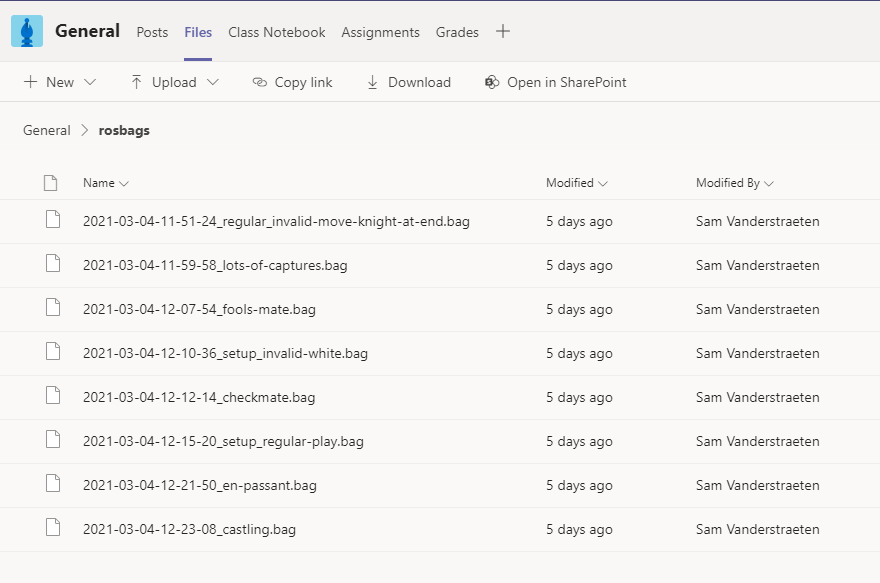

Er werden een aantal `ROSbags` opgenomen met demo games. Hiermee kan je een 'live' scenario simuleren, bij gebrek aan werken op locatie.
Sommige games spelen tot schaakmat, sommigen bevatten ongeldige zetten, ... Voor elk wat wils. ;)
Wanneer een specifiek testscenario gewenst is, laat je dit even weten aan Sam & Sam.

De ROSbags waren te groot om in deze repo te steken, maar zijn terug te vinden onder 'Files' in het 'General' channel in het MS Team van het Research Project:

[Link naar MS Teams folder](https://teams.microsoft.com/_#/school/files/General?threadId=19%3Aab2e46f5fbec414b94f63429cdd97351%40thread.tacv2&ctx=channel&context=rosbags&rootfolder=%252Fsites%252FResearchProjectAI20-21%252FGedeelde%2520documenten%252FGeneral%252Frosbags)

